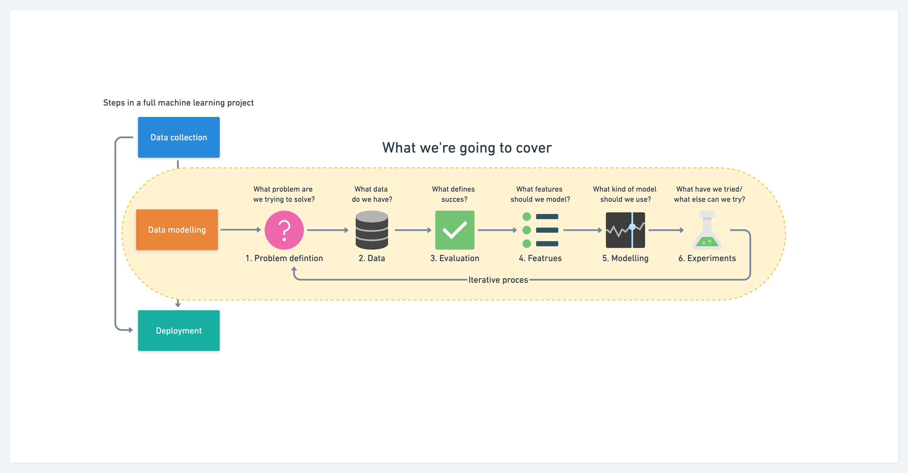

# The Learning Curve

The approach of our will be full hands-on. The concepts will unfold itself as we move onwards through the course. 

We will follow the process that is decribed in the image below

## Module 1 Parametric Model -- Part 1 

01. Into Machine Learning with Linear Regression
02. Simple Linear Regression
03. Multiple Linear Regression
04. Polymonial Linear Regression
05. Boston house pricing
06. Non-Linear Regression

## Module 2 Parametric Model -- Part 2 

03. Into Machine Learning with Logistic Regression
